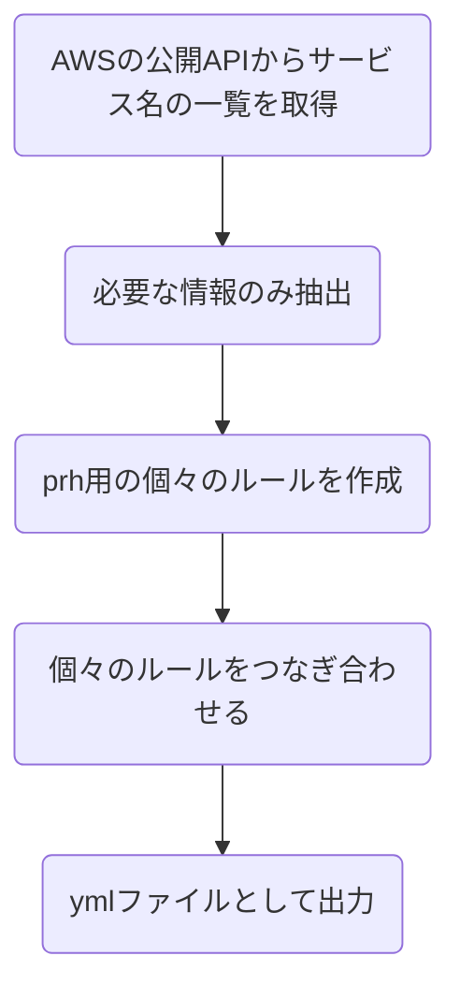
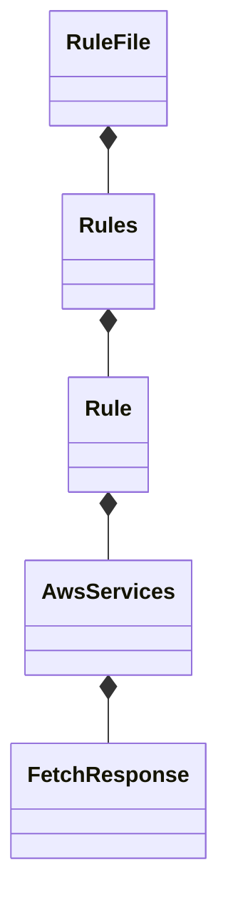

# Contributing to textlint-rule-aws-service-name

textlint-rule-aws-service-name はAWSサービス名のtypoを予防するためのtextlintルールです。

このパッケージの開発において、いくつか制約やルールを設けていますので、コントリビューターの皆様は事前にご確認下さい。

## Conventional Commits

このプロジェクトには[semantic-release/semantic-release](https://github.com/semantic-release/semantic-release)を導入して、各種リリース作業の効率化を図っています。

semantic-releaseの制約上、コミットメッセージには[Conventional Commits](https://www.conventionalcommits.org/ja/v1.0.0/)を利用する必要があります。

このリポジトリには、`husky` と `commitlint` を導入して、コミットメッセージをConventional Commitsの形式に合うかチェックする仕組みを導入しています。

コミットメッセージは次の規約に準拠します。

[commitlint/@commitlint/config-conventional](https://github.com/conventional-changelog/commitlint/tree/master/%40commitlint/config-conventional)

コミットメッセージのフォーマットは以下のように規定しています。

```
<type>[optional scope]: <subject>

[optional body]

[optional footer(s)]
```

type, subjectは必須です。

### コミットメッセージ例

新規機能追加に伴う変更

```
feat: 不要なスペースの混入を検知するルールクラス追加
```

コメントの追加やコードに影響を与えない変更など

```
chore: RuleFileクラスにdocstringを追加
```

バグ修正など

```
fx: アッパーキャメルケースのルールが機能しないバグの修正
```

## Product Architecture

### Check text with prh.yml

`src/index.js`  を実行することにより、[auto-create-regular-rules.yml](dict/auto-create-regular-rules.yml)に記載するルールに照らし合わせてチェックします。

チェックの仕組みは以下モジュールの仕組みを利用しており、実際に以下モジュールに提供するためのprh用のymlファイルを動的に作成することです。

https://github.com/textlint-rule/textlint-rule-prh

ymlを作成するためのクラス構成などについては以下をご確認下さい。

### Create prh.yml

[auto-create-regular-rules.yml](dict/auto-create-regular-rules.yml)は `src/*.ts` に記載するスクリプトで更新（ファイルがなければ作成）されます。

全体の処理概要は以下のようなフローとなっています。



以下のように関心ごとにクラスを分けて、基本的に継承を使わずに実装しています。

厳密に言えば、[createRule.ts](./src/createRule.ts)内でそれぞれのクラスインスタンスを作成して、処理を呼び出しています。



APIはこちらのJSONフィードを利用しています。

https://aws.amazon.com/api/dirs/items/search?item.directoryId=whats-new
