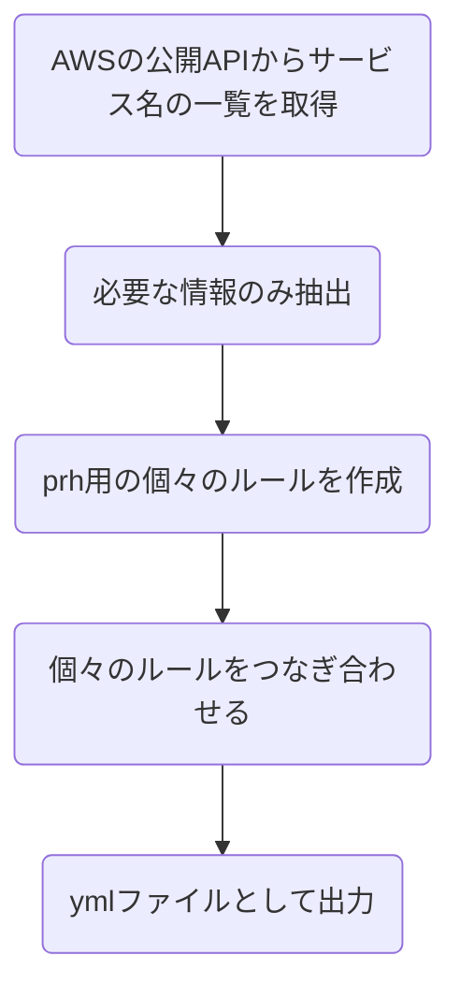
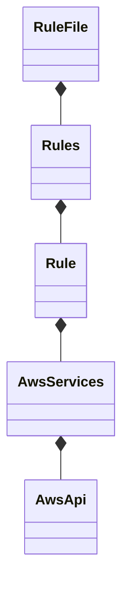

# Contributing to textlint-rule-aws-service-name

textlint-rule-aws-service-name はAWSサービス名のtypoを予防するためのtextlintルールです。

このパッケージの開発において、いくつか制約やルールを設けていますので、コントリビューターの皆様は事前にご確認下さい。

## リリース

リリースはタグプッシュをトリガーとして、GitHub Actions 上で npm trusted publishing (provenance) により自動公開されます。

```bash
# 新しいバージョンをリリースする場合 (例: 1.14.0)
git tag v1.14.0
git push origin v1.14.0
```

タグプッシュ後、`.github/workflows/release.yml` が以下を自動で行います。

- `package.json` / `package-lock.json` のバージョン更新 (PR が自動作成される)
- npm への公開 (`npm publish --provenance`)
- GitHub Release とリリースノートの生成

## Product Architecture

### Check text with prh.yml

`src/index.js`  を実行することにより、[auto-create-regular-rules.yml](dict/auto-create-regular-rules.yml)に記載するルールに照らし合わせてチェックします。

チェックの仕組みは以下モジュールの仕組みを利用しており、実際に以下モジュールに提供するためのprh用のymlファイルを動的に作成することです。

https://github.com/textlint-rule/textlint-rule-prh

ymlを作成するためのクラス構成などについては以下をご確認下さい。

### Create prh.yml

[auto-create-regular-rules.yml](dict/auto-create-regular-rules.yml)は `src/*.ts` に記載するスクリプトで更新（ファイルがなければ作成）されます。

全体の処理概要は以下のようなフローとなっています。


```mermaid
flowchart TD
  AwsApi("AWSの公開APIからサービス名の一覧を取得")
    --> AwsServices("必要な情報のみ抽出")
    --> Rule("prh用の個々のルールを作成")
    --> Rules("個々のルールをつなぎ合わせる")
    --> RuleFile("ymlファイルとして出力")
```

以下のように関心ごとにクラスを分けて、基本的に継承を使わずに実装しています。

厳密に言えば、[createRule.ts](./src/createRule.ts)内でそれぞれのクラスインスタンスを作成して、処理を呼び出しています。


```mermaid
classDiagram
    RuleFile *-- Rules
    Rules *-- Rule
    Rule *-- AwsServices
    AwsServices *-- AwsApi
```

APIはこちらのJSONフィードを利用しています。

https://aws.amazon.com/api/dirs/items/search?item.directoryId=whats-new
