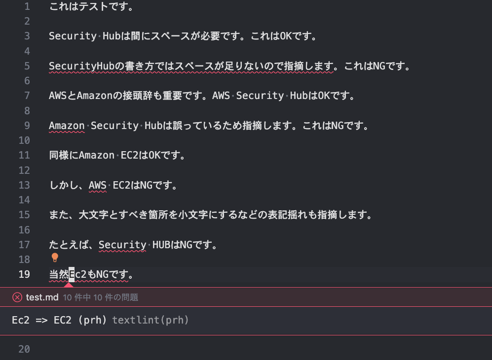
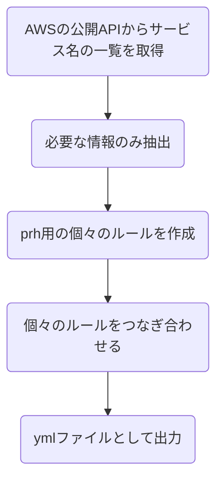
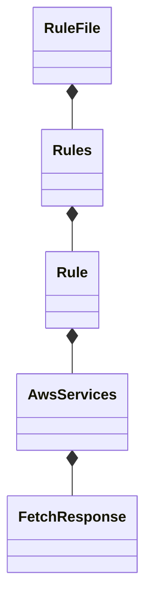

# textlint-rule-aws-service-name

textlint rule for AWS product Names.

AWSのサービス名やプロダクト名の表記揺れをチェックするためのtexlintのルールです。

※ 重要: **AWS公式のサービスではありません。1ユーザーの活動です。**

以下のように表記揺れを検出します。（画像はVSCodeの拡張機能を利用）



## Product Architecture

### Check text with prh.yml

`src/index.js`  を実行することにより、[prh.yml](./prh.yml)に記載するルールに照らし合わせてチェックします。

チェックの仕組みは以下モジュールの仕組みを利用しており、実際に以下モジュールに提供するためのprh用のymlファイルを動的に作成することです。

https://github.com/textlint-rule/textlint-rule-prh

ymlを作成するためのクラス構成などについては以下をご確認下さい。

### Create prh.yml

全体の処理概要は以下のようなフローとなっています。



以下のように関心ごとにクラスを分けて、基本的に継承を使わずに実装しています。

厳密に言えば、[createRule.ts](./src/createRule.ts)内でそれぞれのクラスインスタンスを作成して、処理を呼び出しています。



APIはこちらのJSONフィードを利用しています。

https://aws.amazon.com/api/dirs/items/search?item.directoryId=whats-new

## Install

Install with [npm](https://www.npmjs.com/):

    npm install textlint-rule-aws-service-name

## Usage

Via `.textlintrc.json`(Recommended)

```json
{
    "rules": {
        "aws-service-name": true
    }
}
```

Via CLI

```
textlint --rule aws-service-name README.md
```

### Build

Builds source codes for publish to the `lib` folder.
You can write ES2015+ source codes in `src/` folder.

    npm run build

### Tests

Run test code in `test` folder.
Test textlint rule by [textlint-tester](https://github.com/textlint/textlint-tester).

    npm test

## License

MIT © bun913
