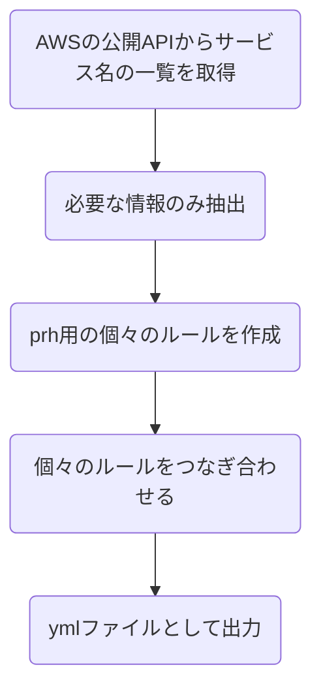
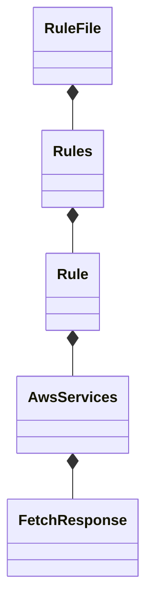

# textlint-rule-aws-service-name

重要: **AWS公式のサービスではありません。1ユーザーの活動です。**

Important: **This Project is UnOffical.**

textlint rule for AWS product Names.

AWSのサービス名やプロダクト名の表記揺れをチェックするためのtexlintのルールです。

以下のように表記揺れを検出します。（画像はVSCodeの拡張機能を利用）


このプロジェクトは以下のリポジトリの影響をモロに受けています。

2019年という早い段階から仕組みづくりをされている　@37108氏に強いリスペクトを表明いたします！

https://github.com/37108/textlint-rule-aws-spellcheck

## Product Architecture

### Check text with prh.yml

`src/index.js`  を実行することにより、[auto-create-regular-rules.yml](dict/auto-create-regular-rules.yml)に記載するルールに照らし合わせてチェックします。

チェックの仕組みは以下モジュールの仕組みを利用しており、実際に以下モジュールに提供するためのprh用のymlファイルを動的に作成することです。

https://github.com/textlint-rule/textlint-rule-prh

ymlを作成するためのクラス構成などについては以下をご確認下さい。

### Create prh.yml

[auto-create-regular-rules.yml](dict/auto-create-regular-rules.yml)は `src/*.ts` に記載するスクリプトで更新されます。

全体の処理概要は以下のようなフローとなっています。



以下のように関心ごとにクラスを分けて、基本的に継承を使わずに実装しています。

厳密に言えば、[createRule.ts](./src/createRule.ts)内でそれぞれのクラスインスタンスを作成して、処理を呼び出しています。



APIはこちらのJSONフィードを利用しています。

https://aws.amazon.com/api/dirs/items/search?item.directoryId=whats-new

## Install

Install with [npm](https://www.npmjs.com/):

    npm install textlint-rule-aws-service-name

## Usage

### textlintrcを利用する場合

Installの後に`.textlintrc.json`に以下のように記述します。

```json
{
    "rules": {
        "aws-service-name": true
    }
}
```

.textlinrc.ymlのようにyml（yaml）の場合は以下のように記載します。

```yml
rules:
  aws-service-name: true
```

### CLIで使う場合

Installの後に以下のようにCLIでも実行できます。

```
textlint --rule aws-service-name README.md
```

### VSCodeで利用する場合

textlintrcを設定の上、以下記事を参考に[拡張機能](https://marketplace.visualstudio.com/items?itemName=taichi.vscode-textlint)を導入してください。

https://qiita.com/takasp/items/22f7f72b691fda30aea2

### 注意事項

以下textlint公式のGitHubにも記載がありますが、textlintのインストール場所とルールのインストール場所が異なる場合はエラーがでます。

https://github.com/textlint/textlint/blob/master/docs/faq/failed-to-load-textlints-module.md

```bash
# NG
npm i -g textlint
npm i textlint-rule-aws-service-name --save-dev
```

```bash
# OK
npm i -g textlint
npm i -g textlint-rule-aws-service-name
```

## できること・できないこと

### できること

- 大文字・小文字の表記揺れの検出
    - `Ec2` -> `EC2`
- 本来スペースが必要なサービスにスペースがないことを検出
    - `SecurityHub` -> `Security Hub`
- 本来スペースが不要なサービスにスペースがあることを検出
    - `Cloud Front` -> `CloudFront`
- `Amazon` と `AWS` の接頭辞の間違い検出
    - `AWS EC2` -> `Amazon EC2`
    - `Amazon Security Hub` -> `AWS Security Hub`

### Build

Builds source codes for publish to the `lib` folder.
You can write ES2015+ source codes in `src/` folder.

    npm run build

### Tests

Run test code in `test` folder.
Test textlint rule by [textlint-tester](https://github.com/textlint/textlint-tester).

    npm test

## License

MIT © bun913
