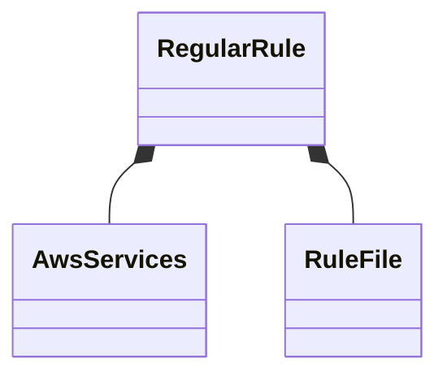

# textlint-rule-aws-service-name

Rule for AWS Product Names

## Product Diagram

### Create prh.yml



## Install

Install with [npm](https://www.npmjs.com/):

    npm install textlint-rule-aws-service-name

## Usage

Via `.textlintrc.json`(Recommended)

```json
{
    "rules": {
        "aws-service-name": true
    }
}
```

Via CLI

```
textlint --rule aws-service-name README.md
```

### Build

Builds source codes for publish to the `lib` folder.
You can write ES2015+ source codes in `src/` folder.

    npm run build

### Tests

Run test code in `test` folder.
Test textlint rule by [textlint-tester](https://github.com/textlint/textlint-tester).

    npm test

## License

MIT © bun913
